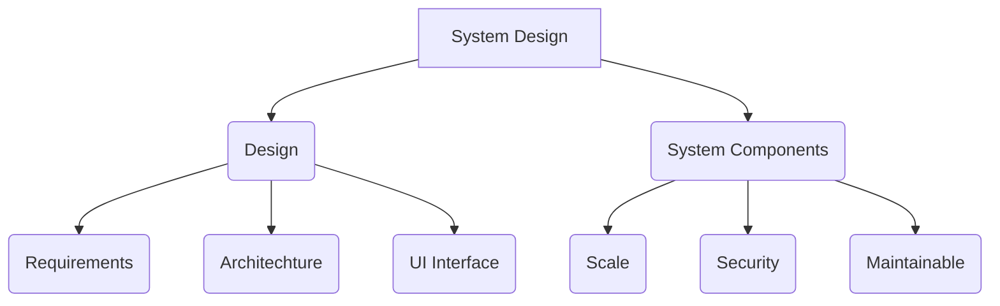

# Frontend System Design

> This repo is a self learning notes from Chakde System design by YT @engineeringchirag
>
> _Click &#9733; if you like the project. Your contributions are heartily ♡ welcome._

### Other cheatsheet or notes links

- [Javascript String Cheatsheet](https://hakeemsalman.github.io/javascript-string-cheatsheet/)
- [Javascript Array Cheatsheet](https://hakeemsalman.github.io/javascript-array-cheatsheet/)
- [HTML learning kit](https://github.com/hakeemsalman/html-learning-kit)

## What is System 

- The name itself says, _We have to build a System, so we need a detailed design._

### Design

- **Requirements:** We need to know the requirements to design the system.
- **Architechture:** We need to know _Which thing fit where_
- **UI Interface:** How the UI looks.

### System

- **Scale:** The system should be scalable
- **Security:** The system should have security.
- **Maitaibility:** The system should be maintainable.
